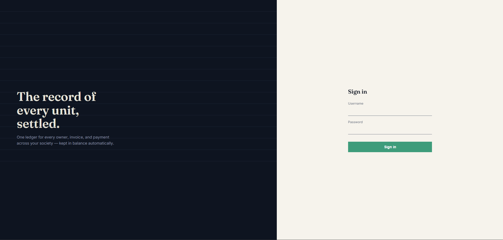
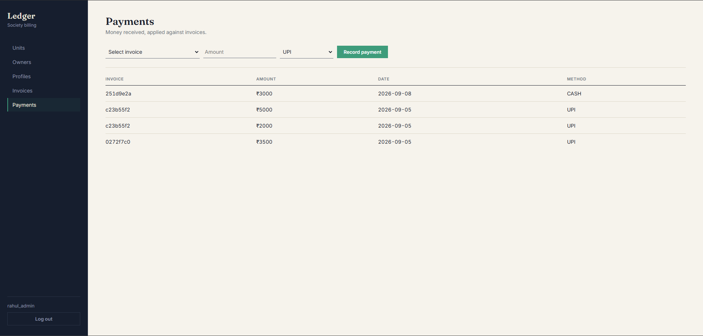
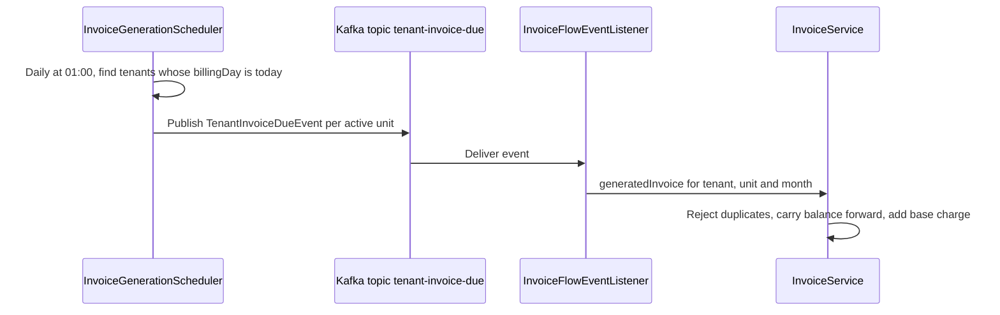
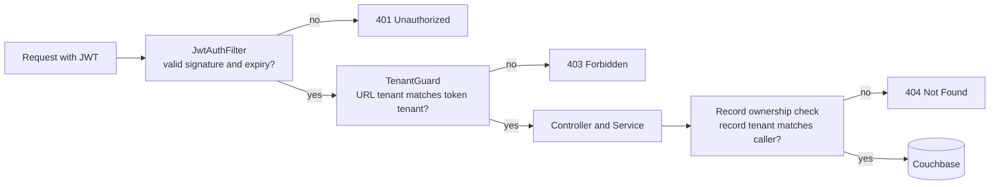

<div align="center">

# Multi-Tenant Housing Society Billing Platform

**One backend, many housing societies. Each with its own units, owners, invoices and payments, fully isolated from the others.**


</div>

Built from scratch as a first backend project, staged deliberately: domain modeling, CRUD, auth, tenant isolation, billing logic, async processing, automation, a working frontend, and finally a security hardening and test pass.

<p align="center">
  
  
</p>

## Contents

- [Features](#features)
- [Architecture](#architecture)
- [Security model](#security-model)
- [Billing rules](#billing-rules)
- [Tech stack](#tech-stack)
- [Getting started](#getting-started)
- [Testing](#testing)
- [API overview](#api-overview)
- [Key design decisions](#key-design-decisions)
- [Known limitations](#known-limitations)
- [Roadmap](#roadmap)
- [Project structure](#project-structure)

## Features

- **Multi-tenant by design.** Each tenant (a housing society) manages its own units, owners, billing profiles (rate plans), invoices and payments, walled off from every other tenant.
- **Automatic invoicing.** Invoices are generated on each tenant's configured billing day and carry the previous balance forward.
- **Payments that keep books balanced.** Payments apply against invoices and move them through `PENDING` → `PARTIAL` → `PAID` automatically.
- **Late fees.** Overdue invoices accrue a late fee once, either a percentage or a fixed amount, configurable per tenant.
- **Asynchronous generation.** Invoice generation runs through Kafka instead of blocking the scheduler thread.
- **Role-based access.** A platform-level `SUPERADMIN` manages tenants; each tenant's `ADMIN` manages only their own society.
- **Tested.** 100 automated tests cover the service layer and every security component.

## Architecture

```
            ┌─────────────┐
            │   Browser   │
            │ (React SPA) │
            └──────┬──────┘
                   │ REST + JWT
            ┌──────▼──────┐
            │ Spring Boot │
            │   Backend   │
            └──┬───────┬──┘
               │       │
      ┌────────▼─┐   ┌─▼────────┐
      │ Couchbase│   │  Kafka   │
      │  (data)  │   │ (events) │
      └──────────┘   └──────────┘
```

### Invoice generation flow

A daily scheduler finds the tenants whose billing day is today and publishes one event per active unit. A separate consumer generates each invoice, so a tenant with many units never blocks invoice generation for everyone else.



### Late fee flow

`LateFeeScheduler` runs daily at 02:00. It picks every invoice that is `PENDING` or `PARTIAL`, past its due date, and has not been charged a late fee yet. It then applies the tenant's fee rule once and flags the invoice so it is never charged twice.

## Security model

### Three layers of tenant isolation

Isolation is enforced at three independent layers, not one:

1. **JWT claims.** Every token embeds the user's `tenantId` and `role`, signed with HMAC-SHA.
2. **Request-level guard.** A `HandlerInterceptor` compares the `tenantId` in the URL with the token's `tenantId` on every `/tenants/{tenantId}/**` route. A mismatch returns `403`.
3. **Per-record ownership check.** Every service method that loads a record by ID re-checks that the record's own `tenantId` matches the caller's. This closes the gap where a matching URL alone would not stop someone from fetching another tenant's record by ID. A mismatch returns `404`, so the API never confirms that another tenant's record exists.



### Who can call what

| Endpoint | Access |
|---|---|
| `POST /auth/login` | Public |
| `GET /actuator/health` | Public |
| `POST /auth/signup` | `SUPERADMIN` for any tenant and role. `ADMIN` for their own tenant only, and never for a `SUPERADMIN` account. Everyone else gets `403`. |
| `GET /tenants`, `POST /tenants` | `SUPERADMIN` only |
| `GET /tenants/{id}` | The tenant's own users, or `SUPERADMIN` |
| `PATCH /tenants/{id}`, `DELETE /tenants/{id}` | `SUPERADMIN` only |
| `/tenants/{tenantId}/**` | Users of that tenant, or `SUPERADMIN` |

Everything except login and health requires a valid `Authorization: Bearer <token>` header. Passwords are stored as BCrypt hashes, tokens expire after 10 hours, and all secrets come from environment variables, never from source control.

## Billing rules

| Rule | Behavior |
|---|---|
| Invoice total | `closingBalance = openingBalance + currentCharges + lateFee + adjustment` |
| Opening balance | Carried from the unit's most recent invoice (`0` for the first one) |
| Current charges | The base charge of the unit's billing profile |
| Due date | The 10th of the billing month |
| Duplicate month | A second invoice for the same unit and month is rejected with `409` |
| One owner per unit | Assigning a unit that already has an owner is rejected with `409` |
| Payments | Reduce the closing balance. Zero or below sets the status to `PAID`, otherwise `PARTIAL`. An overpayment leaves a negative balance (credit). |
| Payment validation | The invoice is validated (exists and belongs to the tenant) before the payment is saved |
| Late fee | Applied once per invoice: a percentage of the closing balance, or a fixed amount |

## Tech stack

| Layer | Technology |
|---|---|
| Backend | Java 21, Spring Boot 4.1.1, Spring Data Couchbase, Spring Kafka |
| Auth | JWT (jjwt), BCrypt (`spring-security-crypto`) |
| Data | Couchbase |
| Messaging | Apache Kafka, Zookeeper |
| Frontend | React, TypeScript, Vite, React Router, Axios |
| Testing | JUnit 5, Mockito, Spring test mocks |
| Infrastructure | Docker Compose |

## Getting started

### Prerequisites

- Java 21
- Node.js and npm
- Docker Desktop

### 1. Start the infrastructure

```bash
docker compose up -d
```

This starts Couchbase, Kafka and Zookeeper.

On first run, open <http://localhost:8091>, set up a new cluster, create a bucket named `billing`, and run this once in the Query workbench:

```sql
CREATE PRIMARY INDEX ON `billing`;
```

### 2. Configure environment variables

Set these in your IDE's run configuration or your shell before starting the backend:

| Variable | Required | Purpose |
|---|---|---|
| `COUCHBASE_USERNAME` | Yes | Couchbase user |
| `COUCHBASE_PASSWORD` | Yes | Couchbase password |
| `JWT_SECRET` | Yes | Key used to sign JWTs. Use a long random string of at least 32 characters. |
| `SUPERADMIN_USERNAME` | First run | Username of the platform administrator to create at startup |
| `SUPERADMIN_PASSWORD` | First run | Password for that account |

The `SUPERADMIN` account is created once at startup if it does not exist yet. It is never overwritten on later runs. If the two `SUPERADMIN_*` variables are not set, the seeder does nothing.

### 3. Run the backend

```bash
cd billing
./mvnw spring-boot:run        # Windows: mvnw.cmd spring-boot:run
```

Check that it is healthy at <http://localhost:8080/actuator/health> and look for `"couchbase": {"status": "UP"}`.

### 4. Run the frontend

```bash
cd billing-ui
npm install
npm run dev
```

Open <http://localhost:5173>.

### 5. First-time setup

Tenants are not self-service, so a new install is set up through the API. On Windows PowerShell use `curl.exe` (or Postman), since plain `curl` is an alias there.

```bash
# 1. Log in as the SUPERADMIN you seeded. Copy "token" from the response.
curl -X POST http://localhost:8080/auth/login \
  -H "Content-Type: application/json" \
  -d '{"username": "<SUPERADMIN_USERNAME>", "password": "<SUPERADMIN_PASSWORD>"}'

# 2. Create a tenant (a housing society). Copy "id" from the response.
curl -X POST http://localhost:8080/tenants \
  -H "Authorization: Bearer <token>" \
  -H "Content-Type: application/json" \
  -d '{"name": "Green Valley Society", "billingDay": 1, "lateFeeType": "PERCENTAGE", "lateFeeValue": 1.5}'

# 3. Create that tenant's first admin
curl -X POST http://localhost:8080/auth/signup \
  -H "Authorization: Bearer <token>" \
  -H "Content-Type: application/json" \
  -d '{"tenantId": "<tenant-id>", "username": "admin", "password": "<password>", "role": "ADMIN"}'
```

Then sign in through the frontend with the tenant admin's credentials. From there the admin manages units, owners, profiles, invoices and payments for their own society.

## Testing

```bash
cd billing
./mvnw test
```

The suite runs **100 tests in a few seconds** without Couchbase or Kafka, because collaborators are mocked with Mockito.

| Area | What is covered |
|---|---|
| Services | Owner, Invoice, Payment, Tenant, Unit and Auth logic, including tenant-mismatch handling on every by-ID lookup |
| Billing | Invoice generation, balance carry-over, duplicate-month rejection, payment status transitions, overpayment, percentage and fixed late fees, overdue selection |
| Security | JWT signing, tamper and expiry rejection, the filter's public and protected paths, every `TenantGuard` allow and deny case, and the signup permission rules |

One integration test that boots the full application context (`BillingApplicationTests`) is marked `@Disabled`, because it needs the environment variables above and running Docker containers.

## API overview

All routes below sit under `/tenants/{tenantId}` and require a token for that tenant.

| Resource | Path |
|---|---|
| Units | `/tenants/{tenantId}/units` |
| Owners | `/tenants/{tenantId}/owners` |
| Billing profiles | `/tenants/{tenantId}/profiles` |
| Invoices | `/tenants/{tenantId}/invoices` |
| Generate an invoice | `/tenants/{tenantId}/invoices/generate` |
| Payments | `/tenants/{tenantId}/payments` |

Errors come back as JSON with `timestamp`, `status`, `error` and `message`.

| Status | Meaning |
|---|---|
| `400` | Bad or unprocessable request |
| `401` | Missing, invalid or expired token |
| `403` | Authenticated, but not allowed to do this |
| `404` | Record not found, or it belongs to another tenant |
| `409` | Business-rule conflict, such as a duplicate invoice or an already-assigned unit |

## Key design decisions

- **Tenant creation is not self-service.** A housing society is not something a stranger signs up for. Tenants and their first admin are created by the platform's `SUPERADMIN`, not through a public form.
- **Signup is closed by default.** There is no public registration. Only an authenticated `SUPERADMIN` or a tenant's `ADMIN` can create users, and the rule is checked in the service layer so it is unit-tested.
- **`PATCH` endpoints require every field.** They do a full overwrite rather than a partial merge, a deliberate simplicity tradeoff that is documented here so it is not a surprise.
- **IDs are human-legible prefixed strings** (`tenant::<uuid>`, `unit::<uuid>`) rather than raw UUIDs, which makes debugging and manual Couchbase queries far easier.
- **Wrong-tenant lookups return `404`, not `403`,** so the API never reveals that another tenant's record exists.
- **Generation is decoupled from scheduling** through Kafka, so one large tenant cannot delay the others.

## Known limitations

- **No pagination.** Fine at current scale, but list endpoints return everything.
- **Tenant filtering happens in memory.** Services load a collection and filter by `tenantId` in Java. The next step is tenant-scoped N1QL queries backed by an index.
- **Couchbase queries are eventually consistent,** so a list read immediately after a write can miss the new document.
- **No cross-document transactions.** Payment validation runs before anything is saved, which covers the common failures, but a failure after the save could still leave a payment unapplied.
- **Deleting a tenant does not cascade** to its units, owners, invoices or payments.
- **Frontend gaps:** no UI for editing or deleting owners and profiles, and none for creating users (done through the API today).
- **Test gaps:** controllers, schedulers, the Kafka listener and `ProfileService` are not covered yet, and there are no end-to-end tests.
- **No Google/OAuth2 login,** which would require mapping an external identity to an existing tenant-scoped user.

## Roadmap

- [ ] Tenant-scoped N1QL queries and pagination
- [ ] Controller and end-to-end tests (Testcontainers for Couchbase and Kafka)
- [ ] Edit and delete UI for owners and profiles
- [ ] User management UI for tenant admins
- [ ] Cascade or soft-delete for tenants
- [ ] Google/OAuth2 login

## Project structure

```
Billing-Platform/
├── billing/                       Spring Boot backend
│   └── src/
│       ├── main/java/com/Aniket/billing/
│       │   ├── model/             Couchbase documents
│       │   ├── repository/        Data access
│       │   ├── service/           Business logic
│       │   ├── controller/        REST endpoints
│       │   ├── security/          JWT filter, JWT utility, tenant guard
│       │   ├── event/             Kafka event and listener
│       │   ├── scheduler/         Invoice generation and late-fee cron jobs
│       │   ├── exception/         Global error handling
│       │   └── config/            CORS, web config, password encoder, SUPERADMIN seeder
│       └── test/java/com/Aniket/billing/
│           ├── service/           Service-layer unit tests
│           └── security/          Filter, guard and JWT tests
├── billing-ui/                    React + TypeScript frontend
├── docs/screenshots/              README images
└── docker-compose.yml             Couchbase + Kafka + Zookeeper, local dev
```

---

Built by [Aniket](https://github.com/AniketOP).
